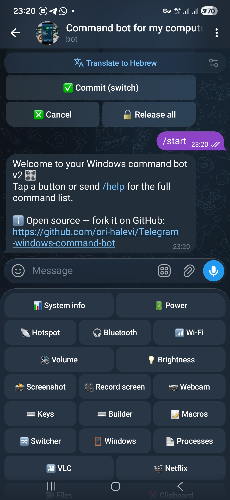
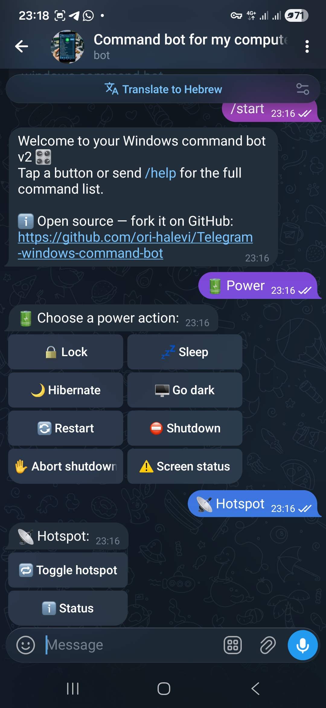
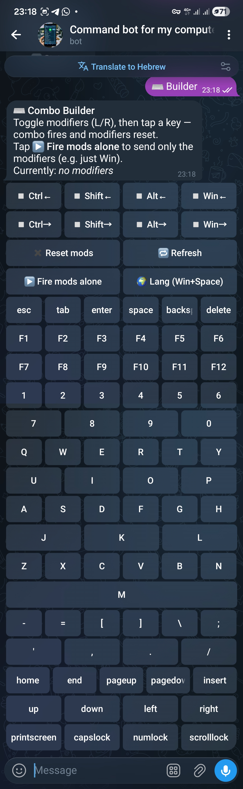

<div align="center">
  

  # Telegram Windows Command Bot

  **Control your Windows PC from anywhere via Telegram.**
  Send any keyboard combo, browse windows, take screenshots, drive VLC/Netflix, manage processes, and more — all from your phone.

  <p>
    
    
    
    
  </p>
</div>

---

## Screenshots

<table>
  <tr>
    <td align="center" width="33%">
      
      <br><sub><b>1. <code>/start</code> + main menu</b><br>every feature one tap away</sub>
    </td>
    <td align="center" width="33%">
      
      <br><sub><b>2. Inline keyboards</b><br>Power · Hotspot · Bluetooth · Wi-Fi · Volume · Brightness · VLC · Netflix</sub>
    </td>
    <td align="center" width="33%">
      
      <br><sub><b>3. ⌨️ Combo Builder</b><br>L/R modifier pills + full key grid + Fire-mods-alone</sub>
    </td>
  </tr>
</table>

## Table of contents

- [What it does](#what-it-does)
- [Highlights](#highlights)
- [Quick start](#quick-start)
- [Detailed setup](#detailed-setup)
- [Usage](#usage)
  - [Main menu](#main-menu)
  - [Recorder](#recorder)
  - [Keyboard combos — three ways](#keyboard-combos--three-ways)
  - [Interactive Alt+Tab switcher](#interactive-alttab-switcher)
  - [Free-text commands](#free-text-commands)
- [Architecture](#architecture)
- [Security](#security)
- [Auto-start on boot (Windows Task Scheduler)](#auto-start-on-boot-windows-task-scheduler)
- [Building a standalone `.exe`](#building-a-standalone-exe)
- [מידע בסיסי בעברית 🇮🇱](#מידע-בסיסי-בעברית-)
- [Contributing](#contributing)
- [License](#license)

---

## What it does

Telegram Windows Command Bot turns Telegram into a **remote control for your Windows machine**. The bot runs as a small Python service on the PC; you send messages to your bot from any Telegram client; the PC executes them and replies. Only the configured owner can issue commands — everyone else gets a polite multilingual "go away" message and is logged.

It is built around a single killer primitive — **arbitrary keyboard combinations** — so you are never limited to predefined buttons. Anything you can do with a real keyboard, you can trigger remotely.

## Highlights

<table>
  <tr>
    <td valign="top">

- **📼 Record & Replay macros** — record any sequence of real mouse movements, clicks, scrolls, and keystrokes; save it under a name; replay it on demand with one tap. DPI-aware coordinate mapping, resolution guard, and a live Pause/Resume button during playback. See [Recorder](#recorder) below.
- **🎹 Flexible keyboard combos** — send *any* hotkey three different ways:
  - Free-text: `k ctrl+alt+del`, `k win+shift+s`, `k alt+f4` …
  - Interactive **Combo Builder** — toggleable L/R modifier pills (`Ctrl←`, `Win→`, `Alt←`, `Shift→`, …) plus a click-to-fire key grid; tap **▶ Fire mods alone** to press just `Win` or just `Ctrl`.
  - Persistent named **macros** — `/save_macro snip win+shift+s`, then `/macro snip`.
- **🔀 Interactive Alt+Tab switcher** — the bot holds `Alt` down between messages and edits a screenshot in-place each time you tap `Tab+1` / `Tab-1`, just like cycling on a real keyboard. Tap **✅ Commit** to release Alt and switch.
- **⌨️ Type any Unicode text** — `type שלום עולם` works (clipboard-paste path, so Hebrew/CJK/emoji work).
- **📸 Capture** — full-screen screenshot, screen recording (configurable seconds), webcam snapshot.
- **🔊 System control** — master volume + mute, screen brightness (via WMI), lock / sleep / hibernate / restart / shutdown / abort, screensaver.
- **🌐 Network** — toggle Mobile Hotspot and Bluetooth, list Wi-Fi networks, current SSID, local & public IP.
- **🪟 Window & process management** — list / focus / close windows, top processes by RAM, kill by name or PID.
- **🎦 Media controls** — VLC and Netflix inline keyboards (play/pause, jump, subtitles, fullscreen, …).
- **📂 Files & shell** — `ls / cd / pwd / download <path>`, `cmd <command>`, `ps1 <powershell>`, `launch <program>`, `url <link>`.
- **🌍 Multilingual security** — intruders get a denial message in 12 languages plus a link to the public source.
- **📜 Atomic state, rotating logs, rate limiting** — production-friendly defaults out of the box.

</td>
    <td valign="top" width="280">
      
      <br><sub>Tapping <b>🔋 Power</b> opens the Power inline keyboard; tapping <b>📡 Hotspot</b> opens its toggle/status menu.</sub>
    </td>
  </tr>
</table>

## Quick start

```powershell
# 1. Clone
git clone https://github.com/ori-halevi/Telegram-windows-command-bot.git
cd Telegram-windows-command-bot

# 2. Create venv (Python 3.12 recommended)
py -3.12 -m venv venv
.\venv\Scripts\Activate.ps1
python -m pip install --upgrade pip wheel
pip install -r requirements.txt

# 3. Configure secrets
copy .env.example .env
notepad .env       # fill BOT_TOKEN, OWNER_CHAT_ID, OWNER_USERNAME

# 4. Run
python main.py
# or simply:  run_bot.bat
```

Now message your bot on Telegram and tap `/start`.

## Detailed setup

### 1. Get a bot token

1. Open Telegram and message [@BotFather](https://t.me/BotFather).
2. Send `/newbot`, choose a name and a `@username`.
3. BotFather returns a **token** like `1234567890:AA…`. Keep it secret.

### 2. Find your chat ID

1. Message [@userinfobot](https://t.me/userinfobot) — it replies with your numeric ID.
2. (Or: send any message to your new bot and visit `https://api.telegram.org/bot<TOKEN>/getUpdates` to see the `chat.id`.)

### 3. Configure `.env`

```dotenv
# --- Required ---
BOT_TOKEN=1234567890:AA....
OWNER_CHAT_ID=111222333
OWNER_USERNAME=your_telegram_username   # without the @

# --- Optional ---
# Authorise additional users (comma-separated)
# EXTRA_OWNER_CHAT_IDS=444555666,777888999
# EXTRA_OWNER_USERNAMES=alice,bob

# Per-chat rate limit, messages per minute (default 60)
# RATE_LIMIT_PER_MINUTE=60

# Default duration for the 🎥 Record screen button, in seconds (default 30)
# SCREEN_RECORD_SECONDS=30

# DEBUG | INFO | WARNING | ERROR (default INFO)
# LOG_LEVEL=INFO
```

### 4. Install dependencies

```powershell
.\venv\Scripts\Activate.ps1
pip install -r requirements.txt
```

The bot uses:

| Package | Purpose |
| --- | --- |
| `python-telegram-bot[rate-limiter,job-queue]==21.6` | async Telegram client |
| `pyautogui`, `keyboard` | keyboard & hotkey emulation |
| `pyperclip` | clipboard read/write |
| `mss`, `opencv-python`, `numpy` | screenshots, screen recording, webcam |
| `psutil` | processes, system metrics |
| `pygetwindow` | window list / focus / close |
| `pycaw`, `comtypes` | master volume |
| `pynput` | OS-level mouse & keyboard capture for the Recorder |
| (PowerShell + WMI) | screen brightness |

### 5. Run

```powershell
python main.py
# or
.\run_bot.bat
```

The bot logs to `logs/bot.log` (rotating, max 5 × 2 MB) and persists state under `data/`.

## Usage

### Main menu

<table>
  <tr>
    <td valign="top">

After `/start`, a reply keyboard appears with these groups:

```
📊 System info  | 🔋 Power
📡 Hotspot      | 🎧 Bluetooth | 📶 Wi-Fi
🔊 Volume       | 💡 Brightness
📸 Screenshot   | 🎥 Record screen | 📷 Webcam
⌨️ Keys         | ⌨️ Builder       | 📝 Macros
📼 Recorder
🔀 Switcher     | 🪟 Windows       | 📄 Processes
🎦 VLC          | 🎬 Netflix
📂 Files        | ✂ Clipboard
💡 Help
```

The welcome message also includes a link back to this repository so anyone you accidentally share the bot with can grab their own copy.

</td>
    <td valign="top" width="280">
      
    </td>
  </tr>
</table>

### Recorder

Tap **📼 Recorder** in the main menu to open the recording interface.

**Recording a macro**

1. Tap **▶️ New Recording** — the message switches to *🔴 Recording Mode*.
2. Perform any actions on the PC: move the mouse, click, scroll, type.
3. Tap **💾 Finish & Save** — the bot stops capturing and asks for a name (supports Hebrew and Latin characters).
4. Type a name — the macro is saved to `data/recordings.json`.

**Replaying**

Tap the `▶ <name>` button next to any saved macro. Replay starts immediately in the background. During playback you can:

| Button | Action |
| --- | --- |
| ⏸ Pause / ▶️ Resume | freeze/unfreeze the replay mid-sequence |
| 🖱 Status | take a screenshot with the current mouse position marked in red |

**Safety features**

- **Resolution guard** — the resolution at record time is stored alongside the events. If the current resolution differs, replay is refused with an error message, preventing misclicks on a different layout.
- **DPI scaling** — coordinates are mapped from OS-virtual to physical pixels at record time so replay lands on the correct pixel even on 125 % / 150 % HiDPI displays.
- **Timing margin** — delays shorter than 50 ms are replayed as-is; longer pauses get a small +10 % buffer to account for UI load time variance.
- **Discard at any time** — tap ⏹️ Stop (discard) or ⬅️ Abort to cancel recording without saving anything.

### Keyboard combos — three ways

**1. Free-text — fastest if you know the combo**

```text
k ctrl+alt+del          # task manager dialog
k win+shift+s           # snip & sketch
k ctrl+shift+esc        # task manager direct
k win+e                 # explorer
k alt+f4                # close window
type שלום עולם           # type Unicode text via clipboard
```

Aliases: `win` = `windows` = `meta` = `cmd`, `control` = `ctrl`, `option` = `alt`, `del` = `delete`, `esc` = `escape`, `pgup` / `pgdn`, `arrowleft` etc.

**2. Combo Builder — visual click-to-toggle**

<table>
  <tr>
    <td valign="top">

Tap **⌨️ Builder** in the menu. You get:

- Two rows of toggleable modifier pills:
  ```
  ▫ Ctrl←  ▫ Shift←  ▫ Alt←  ▫ Win←
  ▫ Ctrl→  ▫ Shift→  ▫ Alt→  ▫ Win→
  ```
- An action row: `✖ Reset mods` · `🔁 Refresh` · **`▶ Fire mods alone`** · **`🌍 Lang (Win+Space)`**
- A grid of every key (esc, F1–F12, 0–9, a–z, punctuation, arrows, home/end, pgup/pgdn, ins/del, capslock, …).

Toggle any combination of modifiers, then tap a key — the combo fires and modifiers reset. Use **▶ Fire mods alone** to press just the toggled modifiers (e.g. tap `Win←` then **Fire** to open the Start menu). The `🌍 Lang` shortcut sends `Win+Space` directly so you can flip keyboard layouts without setting any modifier.

</td>
    <td valign="top" width="280">
      
    </td>
  </tr>
</table>

**3. Macros — saved sequences**

```text
/list_macros                          # see all macros
/macro task_manager                   # run a saved one
/save_macro snip   win+shift+s        # save a single combo
/save_macro flow   win+r ; chrome ; enter   # save a sequence (semicolons)
/delete_macro snip
```

Defaults shipped: `task_manager`, `lock`, `show_desktop`, `explorer`, `run`, `snip`, `settings`, `search`, `action_center`, `switcher`, `close_window`, `new_desktop`, `next_desktop`, `prev_desktop`.

### Interactive Alt+Tab switcher

Tap **🔀 Switcher** in the main menu. The bot:

1. Presses-and-holds `Alt` (so the Windows task switcher overlay stays visible),
2. Presses `Tab` once,
3. Sends you a screenshot with an inline keyboard.

Then:

| Button | Action |
| --- | --- |
| `Tab+1 ➡`, `Tab+2 / 3 / 5 / 10` | tap forward through windows |
| `⬅ Tab-1`, `Tab-2 / 3` | tap backward (Shift+Tab) |
| `✅ Commit (switch)` | release Alt → focus the highlighted window |
| `❎ Cancel` | press Esc, then release Alt |
| `🔓 Release all` | safety: release any held modifier |

Each tap **edits the same photo message in-place** with a fresh screenshot, so you watch the switcher overlay update like a real keyboard. If the switcher is left active idle for 120 seconds, the next interaction auto-releases Alt to avoid a stuck modifier. You can also send `/release_keys` at any time as a manual safety net.

### Free-text commands

| Command | Meaning |
| --- | --- |
| `k <combo>` / `keys <combo>` / `hotkey <combo>` | press an arbitrary key combination |
| `type <text>` / `t <text>` | type/paste arbitrary Unicode text |
| `info` | system info (CPU, RAM, disks, uptime, battery) |
| `lock` / `sleep` / `hibernate` | quick power actions |
| `shutdown [N]` / `restart [N]` / `abort_shutdown` | scheduled power (default 5 s delay) |
| `vol [0-100]` / `mute` | master volume / toggle mute |
| `bright [0-100]` | screen brightness |
| `mouse [pos\|move x y\|click [left\|right]\|scroll N]` | mouse control |
| `ps` / `kill <name\|pid>` | process list / terminate |
| `focus <title>` / `close <title>` | window manager |
| `ls [path]` / `pwd` / `cd <path>` / `download <path>` | file browsing & upload |
| `wifi` / `ip` | Wi-Fi info / local & public IP |
| `copy <text>` / `paste` | clipboard |
| `cmd <command>` / `ps1 <command>` | run shell or PowerShell |
| `launch <program>` / `url <link>` | open programs / URLs |
| `/macro <name>` / `/save_macro` / `/list_macros` / `/delete_macro` | macros |
| `/about` | public info + GitHub link |
| `/release_keys` | safety: release Alt / Ctrl / Shift / Win |
| `/help` | full reference inside the bot |

## Architecture

The codebase follows **Feature-Sliced Design (FSD)** adapted for a Python Telegram bot. Three layers, strict dependency direction `features → core → shared`. Each feature is a self-contained folder; the composition root iterates `ALL_FEATURES` and calls `feature.register(app)` on each.

```
project/
├── main.py                        # entry point
├── run_bot.bat
├── app/
│   ├── composition.py             # build_app() — wires every feature into the Application
│   │
│   ├── shared/                    # zero-domain utilities
│   │   ├── atomic_json.py
│   │   ├── logging.py
│   │   └── telegram_utils.py
│   │
│   ├── core/                      # bot-wide concerns (depends only on shared/)
│   │   ├── config.py              # CONFIG, ROOT, DATA_DIR, LOG_DIR
│   │   ├── security.py            # owner check, rate limiter, intruder log
│   │   ├── auth.py                # @owner_only decorator + alert_intruder
│   │   ├── messages.py            # WELCOME, INTRUDER (12 langs), ABOUT, HELP
│   │   ├── menu.py                # main reply keyboard + label constants
│   │   ├── router.py              # chain-of-responsibility text dispatcher
│   │   ├── errors.py              # global error handler
│   │   └── types.py               # TextResult dataclass
│   │
│   └── features/                  # one folder per feature
│       ├── start_help/            # /start, /help, /about, /release_keys
│       ├── keys/                  # ⌨️ Keys, ⌨️ Builder, k <combo>, type
│       ├── macros/
│       ├── switcher/              # 🔀 interactive Alt+Tab
│       ├── system/                # 📊 info + 🔋 power
│       ├── audio/                 # 🔊 volume, mute
│       ├── brightness/            # 💡 via PowerShell + WMI
│       ├── screen/                # 📸 + 🎥
│       ├── webcam/                # 📷
│       ├── mouse/                 # cursor / click / scroll
│       ├── windows_proc/          # 🪟 windows + 📄 processes
│       ├── files/                 # 📂 + download
│       ├── clipboard/             # ✂
│       ├── network/               # 📡 / 🎧 / 📶 / ip
│       ├── shell/                 # cmd / ps1 / launch / url
│       ├── media/                 # 🎦 VLC + 🎬 Netflix
│       └── recorder/              # 📼 record & replay mouse/keyboard macros
│
├── data/                          # persistent JSON state (atomic writes)
│   ├── key_builder_state.json
│   └── macros.json
├── logs/                          # rotating bot.log
└── intruders.json                 # log of unauthorized attempts
```

**Each feature folder contains:**

| File | Role |
| --- | --- |
| `service.py` | Pure logic. **No** Telegram imports. |
| `ui.py` *(optional)* | Inline keyboard builders for this feature. |
| `handlers.py` | Telegram glue. Exposes `register(app)` and `match_text(text, chat_id) → TextResult \| None`. |
| `__init__.py` | Re-exports `register`, `match_text`, and any helpers other features need (e.g. `keys.send_combos` is consumed by `macros`). |

**Why FSD?**

- Each feature is a **plug-in** — adding or removing one means touching one folder and one line in `app/features/__init__.py`.
- No god-files: there is no central `handlers.py` or `ui.py`. Inline keyboards live next to the logic that uses them.
- The text dispatcher is a **chain of responsibility** — `core/router.py` walks `ALL_FEATURES` in order and asks each `match_text(text, chat_id)`. The first non-`None` reply wins. Heavy/stateful features (screenshot, recording, webcam, switcher) skip the chain and register their own `MessageHandler` so they can stream binary uploads.
- Callbacks are **namespaced per feature** (`vlc:`, `nfx:`, `kb:`, `sw:`, `vol:`, `bright:`, `power:`, `net:`) and routed via `CallbackQueryHandler(pattern=r"^ns:")` — no central callback dispatcher.

## Security

- **Owner gate.** Every handler is wrapped by `@owner_only` (or its inline equivalent). Authorisation = (numeric `chat_id` ∈ `{OWNER_CHAT_ID} ∪ EXTRA_OWNER_CHAT_IDS`) **or** (`username` ∈ `{OWNER_USERNAME} ∪ EXTRA_OWNER_USERNAMES`).
- **Multilingual intruder response.** Strangers receive `🚨 Only the owner can use this bot. Your activity has been logged.` translated into English, Hindi, Russian, Spanish, Chinese, Arabic, French, German, Portuguese, Japanese, Turkish, and Hebrew, plus a link back to this repo.
- **Intrusion log.** `intruders.json` accumulates `{user_id → first_attempt, last_attempt, attempts, name, username}`. Writes are atomic (temp file + `os.replace`) with a single rotating `.bak`.
- **Per-chat rate limit.** A sliding 60-second window allows at most `RATE_LIMIT_PER_MINUTE` messages from any single chat (default 60). Excess gets `⏱ Slow down — rate limit hit.`.
- **Forwarded evidence.** When an unknown user without a username messages the bot, their original message is *forwarded* to the owner so it can be inspected.

> ⚠️ **Network exposure.** This bot polls Telegram — no incoming ports are opened on your PC. But anyone who learns your `BOT_TOKEN` can impersonate the bot, so keep `.env` out of version control.

## Auto-start on boot (Windows Task Scheduler)

Build a one-file `.exe` (see next section), then register it to launch at user logon:

```powershell
SCHTASKS /CREATE /SC ONLOGON `
  /TN "Telegram-Windows-Command-Bot" `
  /TR '"C:\path\to\Telegram windows command bot.exe"' `
  /RL HIGHEST
```

Or run the script form directly via a `.bat` shortcut placed in `shell:startup`.

## Building a standalone `.exe`

```powershell
.\venv\Scripts\Activate.ps1
pip install pyinstaller

pyinstaller --onefile -w -i "bot.png" `
  --paths "venv\Lib\site-packages" `
  main.py

# clean up
Move-Item .\dist\main.exe ".\Telegram windows command bot.exe" -Force
Remove-Item -Recurse -Force .\build, .\dist
Remove-Item .\main.spec
```

The single `.exe` will still need `.env` and the `data/` and `logs/` folders next to it (they are created on first run).

---

## מידע בסיסי בעברית 🇮🇱

> בוט טלגרם ששולט על מחשב Windows מרחוק.

**מה זה?**
שולחים הודעות לבוט בטלגרם — והמחשב מבצע את הפקודות. שילוב מקשים כלשהו, צילומי מסך, נעילה / שינה / כיבוי, שליטה ב־VLC ובנטפליקס, קריאת פרוצסים, גלישה בקבצים, הקלטת מסך, **הקלטה וניגון מחדש של מאקרו עכבר/מקלדת** ועוד.

**הפיצ'ר המרכזי — שילובי מקשים גמישים**
אפשר לשלוח כל קומבינציה: `k ctrl+alt+del`, `k win+shift+s`, `k alt+f4`. אם לא זוכרים את התחביר — לוחצים על **⌨️ Builder** ובונים את הקומבינציה בלחיצות (יש Ctrl/Shift/Alt/Win לשני הצדדים, ימין ושמאל). אפשר גם לשמור macros עם שם:

```
/save_macro snip win+shift+s
/macro snip
```

**הקלטה וניגון מחדש של מאקרו 📼**
לוחצים על **📼 Recorder** בתפריט, מתחילים הקלטה, מבצעים כל פעולה על המחשב (עכבר, קלידים, גלילה), לוחצים **💾 Finish & Save** ונותנים שם. בניגון חוזר: הבוט בודק שהרזולוציה זהה, מפעיל את הרצף עם מרווח בטיחות קטן, ומאפשר **השהייה/חידוש** בזמן ריצה.

**מתג חלונות אינטראקטיבי 🔀**
כפתור **Switcher** מדמה לחיצה ארוכה על Alt+Tab — הבוט מחזיק את Alt לחוץ, אתה לוחץ `Tab+1` או `Tab+5` בטלגרם, מקבל צילום מסך מעודכן של מתג החלונות, ובוחר ✅ Commit להחליף לחלון המסומן.

**הקמה מהירה**
1. הורד את הקוד מהריפו.
2. צור סביבה וירטואלית עם Python 3.12 והתקן את `requirements.txt`.
3. הוצא טוקן בוט מ־[@BotFather](https://t.me/BotFather), מצא את ה־Chat ID שלך אצל [@userinfobot](https://t.me/userinfobot).
4. העתק את `.env.example` ל־`.env` ומלא `BOT_TOKEN`, `OWNER_CHAT_ID`, `OWNER_USERNAME`.
5. הפעל עם `python main.py` או `run_bot.bat`.

**אבטחה**
רק המשתמש שמוגדר בקובץ `.env` יכול לשלוח פקודות. כל ניסיון של מישהו אחר נרשם ל־`intruders.json` ומועבר אליך כהתראה. הזרים מקבלים תגובה אדיבה ב־12 שפות עם קישור לפרויקט הפתוח שלך.

**הפעלה אוטומטית עם הדלקת המחשב**
ראה את הסעיף [Auto-start on boot](#auto-start-on-boot-windows-task-scheduler) למעלה.

---

## Contributing

Issues and pull requests welcome. The Feature-Sliced layout makes it easy to add a new feature:

1. `mkdir app/features/<your_feature>/`
2. Create `service.py`, `handlers.py`, optionally `ui.py`, and an `__init__.py` that re-exports `register` and `match_text`.
3. Add the module to `app/features/__init__.py` and to the `ALL_FEATURES` list.
4. That's it — your feature will be wired in automatically on next launch.

Please **never commit** `.env`, `intruders.json`, `data/key_builder_state.json`, or `logs/`.

## License

This repository is currently published without an explicit license, which means
all rights are reserved by default. If you want to use the code in your own
project, open an issue and the maintainer will gladly discuss adding a permissive
license (MIT is recommended for a project of this scope).

---

<sub>Built with ❤️ in Israel · powered by [python-telegram-bot](https://github.com/python-telegram-bot/python-telegram-bot) · [pyautogui](https://github.com/asweigart/pyautogui) · [pycaw](https://github.com/AndreMiras/pycaw) · [mss](https://github.com/BoboTiG/python-mss).</sub>
